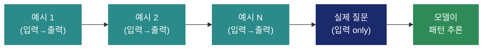
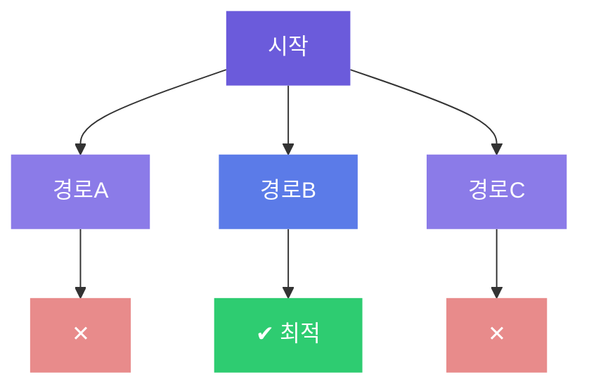
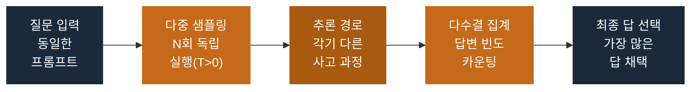

- [고급 프롬프트 기법 (1)](#고급-프롬프트-기법-1)
  - [Zero-shot / Few-shot / Chain-of-Thought(CoT)](#zero-shot--few-shot--chain-of-thoughtcot)
  - [Zero-shot 기법](#zero-shot-기법)
  - [Few-shot 기법](#few-shot-기법)
  - [Chain-of-Thought (CoT) 기법](#chain-of-thought-cot-기법)
    - [CoT 미적용 vs 적용 비교](#cot-미적용-vs-적용-비교)
    - [주요 CoT 유형](#주요-cot-유형)
- [고급 프롬프트 기법 (2)](#고급-프롬프트-기법-2)
  - [Role Prompting](#role-prompting)
    - [기본 템플릿](#기본-템플릿)
  - [Tree-of-Thought (ToT)](#tree-of-thought-tot)
    - [❌ CoT — 단일 선형 추론](#-cot--단일-선형-추론)
    - [✅ ToT — 트리 구조 탐색](#-tot--트리-구조-탐색)
  - [Self-Consistency](#self-consistency)
    - [작동 프로세스](#작동-프로세스)
  - [할루시네이션(Hallucination) 이란?](#할루시네이션hallucination-이란)
    - [할루시네이션 유형](#할루시네이션-유형)
    - [할루시네이션 방지 전략](#할루시네이션-방지-전략)
    - [실전 프롬프트 템플릿](#실전-프롬프트-템플릿)


# 고급 프롬프트 기법 (1)

## Zero-shot / Few-shot / Chain-of-Thought(CoT)

**프롬프팅(Prompting)이란?**

- LLM(대형 언어 모델)에게 입력하는 텍스트 지시문
- 모델의 출력 품질을 결정하는 핵심 요소
- 프롬프트 설계 방식에 따라 결과가 극적으로 달라짐
- 별도의 학습 없이 모델 행동을 제어 할 수 있음

**왜 중요한가?**

- Fine-tuning 없이 성능 극대화 가능
- 복잡한 추론/창작/분석 작업 수행
- 비용 절감 & 빠른 프로토타이핑
- 도메일 특화 출력 형식 제어

> “Garbage in, Garbage out” — 좋은 프롬프트 없이는 좋은 결과도 없다
> 

---

## Zero-shot 기법

> **정의**
예시(Example)나 시연 없이, 작업 지시만으로 LLM이 원하는 출력을 생성하도록 유도하는 기법
> 

| 특징 | 장점 | 단점 |
| --- | --- | --- |
|   • 별도 예시 불필요
  • 간결한 프롬프트
  • 빠른 적용 가능 |   • 프롬프트 길이 최소화
  • 다양한 작업에 범용 적용
  • 응답 속도 빠름 |   • 복잡한 작업 성능 저하
  • 모호한 지시에 취약
  • 출력 형식 제어 어려움 |

<aside>
🗨️

프롬프트 예시

**User**: 다음 문장의 감정을 분류해줘: ‘오늘 발표가 정말 잘 됐어!’
**AI**: 긍정(Positive)

</aside>

---

## Few-shot 기법

> **정의**
소수의 입출력 예시(Shot)를 프롬프트에 포함시켜 LLM이 원하는 패턴/형식/스타일로 응답하도록 유도하는 기법
> 

작동 원리



| 장점 | 단점 | 핵심 팁 |
| --- | --- | --- |
|   • 출력 형식 정밀 제어
  • 복잡한 패턴 학습
  • 도메인 특화 가능
  • 일관성 높은 출력 |   • 프롬프트 길이 증가
  • 예시 품질이 결과 좌우
  • 토큰 비용 증가
  • 나쁜 예시 = 나쁜 결과 |   • 다양한 예시 포함
  • 입출력 형식 일관성 유지
  • 실제 데이터 활용
  • 2~5개 예시가 최적 |

---

## Chain-of-Thought (CoT) 기법

> **정의**
모델이 최종 답변을 바로 출력하지 않고, 중간 추론 단계(사고 과정)를 단계별로 생성하도록 유도하는 기법
> 

### CoT 미적용 vs 적용 비교

**CoT 미적용**

**CoT 적용**

```
Q: 사과 5개에서 2개를 먹고 
친구에게 3개를 줬다. 남은 개수는?
A:
3개 <- 오답!
```

```
Q: 위와 동일 (단계적으로 생각해봐)
1단계: 5-2=3개 남음
2단계: 3-3=0개 남음
A:
0개 <- 정답!
```

### 주요 CoT 유형

- Zero-shot CoT: “단계적으로 생각해봐” 한 마디로 CoT 유도
- Few-shot CoT: 추론 과정 포함된 예시를 제시하여 CoT 학습
- Auto-CoT: 자동으로 다양한 추론 예시를 생성/선택

---

# 고급 프롬프트 기법 (2)

## Role Prompting

> **정의**
LLM에게 특정 전문가/캐릭터/페르소나의 역할을 부여함으로써, 해당 도메인에 특화된 고품질 응답을 유도하는 기법
> 

**작동 원리**

```
당신은 XX 전문가입니다"라는 시스템 프롬프트로 모델의 응답 스타일/어휘/관점을 전환
```

**효과**

- 전문 용어 정확 사용
- 도메인 특화 관점 제공
- 응답 일관성 향상
- 응답 깊이/구조 개선

**주의사항**

- 역할 설명이 모호하면 효과 감소
- 역할 유지 지속적 강조 필요
- 역할 벗어나는 질문에 취약
- 사실 오류 가능성 존재

### 기본 템플릿

```
System: 당신은 10년 경력의 [도메인] 전문가 입니다. [전문 분야 특성] 관점에서 답변해주세요.
User: [실제 질문]
AI: -> 전문가 관점의 구조적/심층적 응답 생성
```

---

## Tree-of-Thought (ToT)

> **정의**
단일 선형 추론(CoT)을 넘어, 여러 가능한 사고 경로를 트리 구조로 탐색/평가/백트래킹하며 최적 해답을 도출하는 기법
> 

### ❌ CoT — 단일 선형 추론


오류 발생 시 되돌아갈 수 없음

### ✅ ToT — 트리 구조 탐색



- 다중 경로: 여러 추론 경로를 병렬 탐색
- 중간 평가: 각 단계마다 진행 방향 평가
- 백트래킹: 막힌 경로는 되돌아 다른 경로 선택
- 최적 선택: 가장 유망한 경로의 최종 답 채택

---

## Self-Consistency

> **정의**
동일한 질문을 여러 번(또는 다양한 방식으로) 실행하여 다수의 추론 경로를 생섯ㅇ하고, 가장 많이 나타나는 답(다수결)을 최종 답으로 채택하는 기법
> 

### 작동 프로세스



---

## 할루시네이션(Hallucination) 이란?

> **정의**
LLM이 사실과 다르거나 존재하지 않는 정보를 마치 사실인 것처럼 자신감 있게 생성하는 현상 (환각, 허위 생성)
> 

### 할루시네이션 유형

1. **사실 오류**: 존재하지 않는 논문/사건/인물/날짜 등을 생성
2. **관계 오류**: 실제 사실을 잘못 연결하거나 인과관계를 왜곡
3. **맥락 무시**: 주어진 문서와 다른 정보를 외부에서 끌어와 혼합
4. **반복/모순**: 이전 발언과 모순되거나 논리 흐름이 깨지는 답

### 할루시네이션 방지 전략

1. 출처 요구
    1. “출처(논문/URL/날짜)와 함께 답해줘”로 검증 가능한 정보만 유도
    2. 효과: 사실 오류 🔽 40~60%
2. 불확실성 표현 요청
    1. “모르면 모른다고 해줘” / “확실하지 않으면 표시해줘” 지시
    2. 효과: 과신 응답 🔽 30~50%
3. RAG (문서 기반 응답)
    1. 외부 문서/DB를 제공하고 해당 내용만 참조하도록 강제 (Grounding)
    2. 효과: 컨텍스트 환각 🔽 70%+
4. 자기 검증 (Self-Verify)
    1. 답변 생성 후 “이 답이 정확한지 검토해줘” 추가 단계 삽입
    2. 효과: 오류 자가 수정률 ⬆️ 
5. Self-Consistency 적용
    1. 동일 질문 여러 번 실행 후 일관된 답만 채택
    2. 효과: 정확도 ⬆️ 10~20%
6. 단계별 분해/검증
    1. 복잡한 질문을 세분화하여 각 단계를 독립적으로 검증 후 종합
    2. 효과: 오류 전파 방지

### 실전 프롬프트 템플릿

```
다음 규칙을 반드시 따르세요:
1. 확실하지 않은 정보는 "[확인 필요]" 또는 "[출처 불명]"으로 표시하세요.
2. 사실을 꾸며내거나 추측하지 마세요. 모를 경우 "모릅니다"라고 명확히 답하세요.
3. 통계/날짜/인명은 반드시 출처를 함께 명시하세요.
4. 제공된 문서 외 외부 지식 사용 시 "[외부 지식]"으로 구분하세요.
```